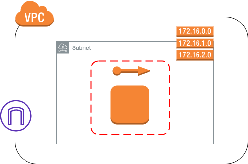

Terraform Moduleのサンプル
==

# 概要
terraform moduleの記事のコードサンプルを格納する。
下記AWS上でVPC、EC2を作成するコードとなる。


# システム構成



# ディレクトリ構成

```
.
├── README.md
├── cloudbuild : コードを実行するGCPのcloudbuildの定義
├── modules : child moduleの定義
├── src : root moduleのコード定義
└── test : root モジュールの内容のテスト
```

# 使い方
